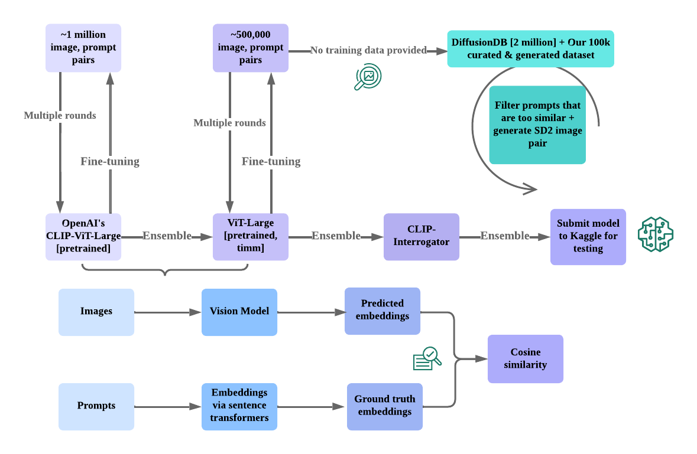

# Ensemble-Based Approach for Predicting Textual Prompts for Stable Diffusion Generated Images

This repository contains an implementation of a novel ensemble-based approach for predicting textual prompts used to generate Stable Diffusion images. The approach surpasses the performance of traditional image captioning models and employs fine-tuned OpenAI CLIP and ViT Large models, along with the CLIP Interrogator (BLIP+CLIP), using a custom dataset consisting of 105k image-prompt pairs. 

## Requirements
- Python 3.6+
- PyTorch 1.7.0+
- Transformers 4.0.0+
- Sentence Transformers 0.3.9+

## Dataset Creation
Creating a high-quality dataset is crucial for the success of the model in predicting text prompts from generated images. The custom dataset contains a wide variety of (prompt, image) pairs generated by Stable Diffusion 2.0. The dataset creation process involves the following steps:
- Prompt Generation: A diverse set of text prompts is generated that covers various topics, styles, and complexities.
- Prompt Cleaning: Redundant or overly similar prompts are removed to improve the quality of the dataset.
- Image Generation: Corresponding images are generated using Stable Diffusion 2.0, ensuring that the generated images are of high quality and accurately represent the given prompts.
- Data Splitting: The dataset is split into training and validation sets, maintaining a balance of prompt styles and complexities across the splits.
- Data Augmentation: Various augmentation techniques are applied to the images in the dataset to improve the model's ability to generalize and prevent overfitting.

## Model Architecture

The model is built on a ViT large CLIP model and fine-tuned using the provided curated dataset of (prompt, image) pairs to adapt the model to the task of predicting text prompts for stable diffusion generated images. The fine-tuning process involves the following steps:
- Loss Function: CosineEmbeddingLoss is used as the loss function during fine-tuning.
- Cosine Learning Rate Scheduling: A cosine learning rate scheduling technique is employed to adapt the learning rate.
- Unfreezing layers: Vision layers 18-23 in the pre-trained model are unfrozen and made trainable.
- Early Stopping: Early stopping is used during the fine-tuning process to prevent overfitting and ensure an optimal model.
- Automatic Mixed Precision (Amp) and Autocast: Mixed-precision training is leveraged using Automatic Mixed Precision (Amp) and Autocast.
- Gradient Scaling: Gradient Scaling is employed to address the issue of small gradients during mixed-precision training.

## Results
At the time of writing, the model was evaluated on the Kaggle competition test set and achieved a cosine similarity score of 0.55865, placing it in the top 11% of the competition, with a ranking of 107 out of 981 participating teams. The ensemble model combines fine-tuned OpenAI CLIP, ViT Large models, and the CLIP Interrogator (BLIP+CLIP) to achieve superior performance over state-of-the-art models like BLIP. The custom dataset consisting of 105 image-prompt pairs played a vital role in enabling the model to learn the latent associations between prompts and images. 

## Conclusion
This research contributes to an enhanced understanding of the relationship between prompts and images and offers potential advancements in generative models, prompt engineering, and multi-modal learning domains. Furthermore, the model's high ranking in the competition highlights its potential to outperform traditional image captioning models and avoid costly pre-training while leveraging pre-trained models.

## References
1. Andrew, G., et al. "Deep Canonical Correlation Analysis." *Proceedings of the 30th International Conference on Machine Learning.* 2013. [[Link]](https://proceedings.mlr.press/v28/andrew13.html)
2. Antol, S., et al. "VQA: Visual Question Answering." *CoRR.* 2015. [[Link]](https://arxiv.org/abs/1505.00468)
3. Cukierski, W., Chow, A. "Stable Diffusion - Image to Prompts." 2023. [[Link]](https://kaggle.com/competitions/stable-diffusion-image-to-prompts)
4. Bernardi, R., et al. "Automatic Description Generation from Images: A Survey of Models, Datasets, and Evaluation Measures." *Journal of Artificial Intelligence Research.* 2016. [[Link]](https://www.jair.org/index.php/jair/article/view/4900)
5. Cornia, M., et al. "M2: Meshed-Memory Transformer for Image Captioning." *CoRR.* 2019. [[Link]](https://arxiv.org/abs/1912.08226)
6. Farhadi, A., et al. "Every Picture Tells a Story: Generating Sentences from Images." *Computer Vision – ECCV 2010.* 2010. [[Link]](https://link.springer.com/chapter/10.1007/978-3-642-15561-1_2)
7. Li, L.H., et al. "VisualBERT: A Simple and Performant Baseline for Vision and Language." *CoRR.* 2019. [[Link]](https://arxiv.org/abs/1908.03557)
8. Lu, J., et al. "ViLBERT: Pretraining Task-Agnostic Visiolinguistic Representations for Vision-and-Language Tasks." *CoRR.* 2019. [[Link]](https://arxiv.org/abs/1908.02265)
9. Mansimov, E., et al. "Generating Images from Captions with Attention." 2016. [[Link]](https://arxiv.org/abs/1511.02793)
10. Ngiam, J., et al. "Multimodal Deep Learning." 2011. [[Link]](https://dl.acm.org/doi/10.5555/2986459.2986534)
11. Radford, A., et al. "Learning Transferable Visual Models From Natural Language Supervision." *CoRR.* 2021. [[Link]](https://arxiv.org/abs/2103.00020)
12. Reed, S.E., et al. "Generative Adversarial Text to Image Synthesis." *CoRR.* 2016. [[Link]](https://arxiv.org/abs/1605.05396)
13. Reimers, N., Gurevych, I. "Sentence-BERT: Sentence Embeddings using Siamese BERT-Networks." *Proceedings of the 2019 Conference on Empirical Methods in Natural Language Processing.* 2019. [[Link]](https://arxiv.org/abs/1908.10084)
14. Vinyals, O., et al. "Show and Tell: A Neural Image Caption Generator." *CoRR.* 2014. [[Link]](https://arxiv.org/abs/1411.4555)
15. Xu, K., et al. "Show, Attend and Tell: Neural Image Caption Generation with Visual Attention." *CoRR.* 2015. [[Link]](https://arxiv.org/abs/1502.03044)
16. Xu, T., et al. "AttnGAN: Fine-Grained Text to Image Generation with Attentional Generative Adversarial Networks." *CoRR.* 2017. [[Link]](https://arxiv.org/abs/1711.10485)
17. Zhang, H., et al. "StackGAN: Text to Photo-realistic Image Synthesis with Stacked Generative Adversarial Networks." *CoRR.* 2016. [[Link]](https://arxiv.org/abs/1612.03242)
