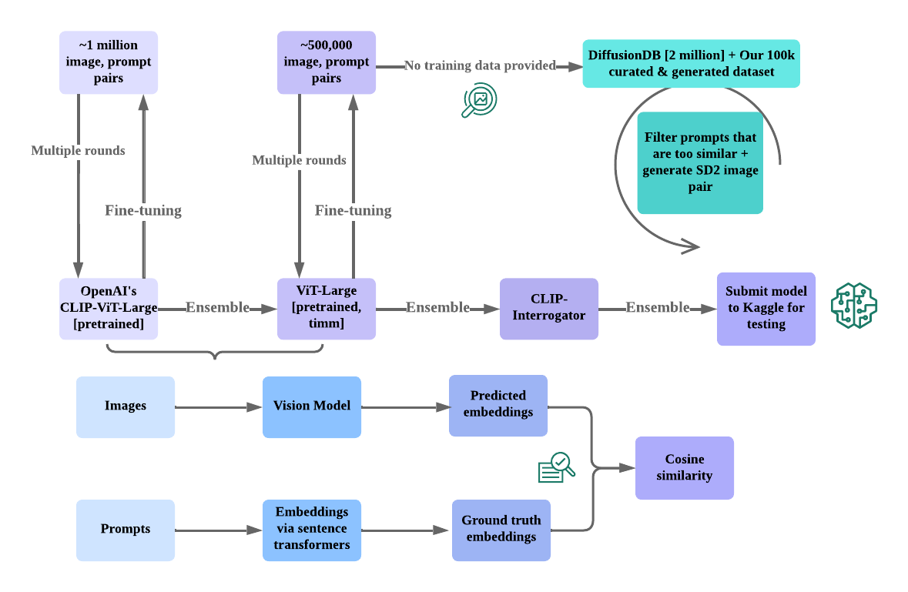

# The Ensemble Effect:
## Leveraging Fine-tuned Models for Prompt Prediction of Stable Diffusion Generated Images
\
\
\

---

## Introduction

- Novel ensemble-based approach for predicting textual prompts used to generate Stable Diffusion images
- Surpasses the performance of traditional image captioning models
- Employs fine-tuned `OpenAI CLIP` and `ViT Large` models, along with the `CLIP Interrogator (BLIP+CLIP)`
- Custom dataset consisting of 105k image-prompt pairs
- Task-specific fine-tuning, attention mechanisms, hyperparameter optimization, and regularization techniques

---

## Methods

- Ensemble of three models: fine-tuned `CLIP`, fine-tuned `ViT-Large`, and `CLIP Interrogator (CI)`
  
- Weighted averaging ensembling techniques

- Custom dataset creation
  - Prompt generation, cleaning, and image generation
  
- Fine-tuning on Stable Diffusion image prompt pairs
  - Loss function, cosine learning rate scheduling, unfreezing layers, early stopping, automatic mixed precision (Amp) and autocast, gradient scaling, data splitting, and data augmentation

---
## Methods

---

## Dataset Creation

- Prompt Generation
  - User-generated prompts from Midjourney Discord server
  - Additional prompts generated using `gpt-3.5-turbo` model
- Prompt Cleaning
  - `Sentence Transformers` for generating embeddings
  - `FAISS` library for efficient vector search
  - Cosine similarity for filtering similar prompts
- Image Generation
  - `Stable Diffusion 2.0` for generating images
  - Random sampling for obtaining representative images

---

## Fine-tuning on Stable Diffusion Image Prompt Pairs

- Loss Function: `CosineEmbeddingLoss`
- Cosine Learning Rate Scheduling (`ViT-L` only)
- Unfreezing layers (`CLIP` only)
- Early Stopping
- Automatic Mixed Precision (`Amp`) and Autocast
- Gradient Scaling
- Data Splitting: 90% training, 10% validation
- Data Augmentation (`ViT-L` only)

---

## Compute Resources

- Dataset Creation
  - NVIDIA `A100-80GB` GPU, 32 vCPU cores, 120 hours
  - Apple `M1 Max` chipset, 24 hours 
  
- Fine-tuning
  - NVIDIA `A10-24GB` GPU, 30 vCPU cores, 47 hours (ViT-L)
  - NVIDIA GeForce `RTX 4070` and `RTX 4090`, 20 cores, 63 hours (CLIP)

---

## Results

| Architecture                | Score |
|-----------------------------|-------|
| Baseline `CLIP`               | 45.32 |
| Fine-tuned `CLIP`             | 55.02 |
| Baseline `ViT-L`              | 43.76 |
| Fine-tuned `ViT-L`            | 54.09 |
| `CLIP Interrogator (BLIP+CLIP)` | 49.30 |
| Ensemble                    | 55.90 |

- Top 13% in the Kaggle competition (143 out of 1133 teams), cos sim score: 0.55865

---

## Discussion

- Custom dataset played a crucial role in the model's success
  - Diverse set of text prompts
  - Filtering out similar prompts
  - High-quality images, matching test set properties
- Fine-tuning process, attention mechanisms, hyperparameter optimization, and regularization techniques contributed to improved prediction accuracy
- Potential advancements in generative models, prompt engineering, and multi-modal learning domains

---

## Future Work

- Explore more advanced ensemble techniques to further improve performance
- Investigate the use of other pre-trained models and architectures for fine-tuning
- Develop methods for generating more diverse and challenging prompts
- Extend the approach to other image generation models and tasks
- Investigate the impact of different data augmentation techniques on model performance

---

## Conclusion

- Ensemble-based approach effectively predicts text prompts for stable diffusion generated images
- Custom dataset of 105k image-prompt pairs played a vital role in model's success
- Fine-tuning, attention mechanisms, hyperparameter optimization, and regularization techniques contributed to improved prediction accuracy
- Potential advancements in generative models, prompt engineering, and multi-modal learning domains
- High ranking in the competition highlights the potential to outperform traditional image captioning models and avoid costly pre-training while leveraging pre-trained models